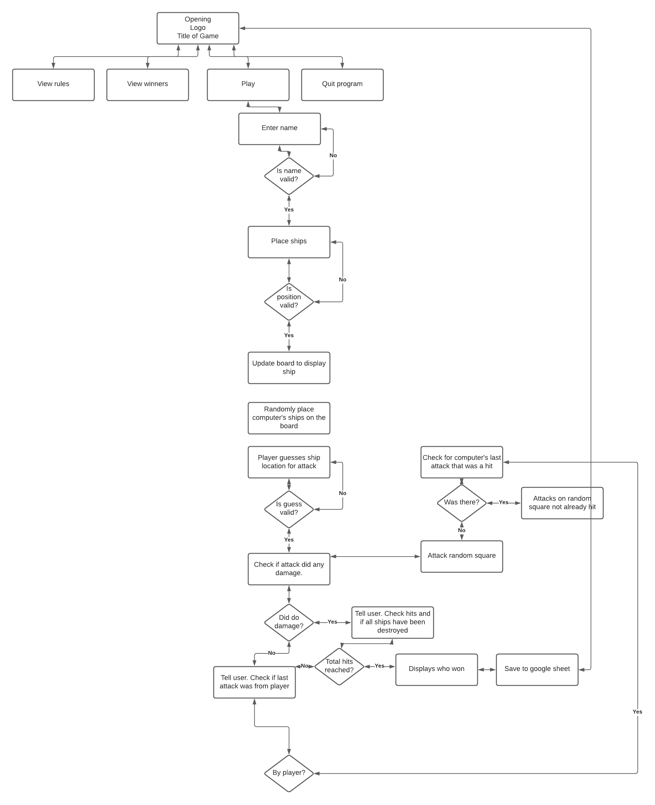

# Battleship
add pic

* 💻 [Deployed Site](https://battleship-cli-game.herokuapp.com/)
* 🗂 [GitHub Repository](https://github.com/sarahjameson/-CI-PP3-Battleship)

## About
Try your hand at playing against a computer! Battleship is a Python command line game where a human can relax and play  against a computer. A definite embarrassment save from losing against a mate!

## Table of Contents
1. [Project Goals](#project-goals)
    1. [User Goals](#user-goals)
    2. [Site Owner Goals](#site-owner-goals)
2. [User Experience](#user-experience)
    1. [Target Audience](#target-audience)
    2. [User Stories](#user-stories)
    3. [User Manual](#user-manual)
3. [Technical Design](#technical-design)
    1. [Flowchart](#flowchart)
    2. [Data Models](#data-models)   
4. [Technologies Used](#technologies-used)
    1. [Languages](#languages)
    2. [Frameworks and Tools](#frameworks-and-tools)
5. [Features](#features)
6. [Testing](#validation)
    1. [Python Validation](#Python-validation)
    2. [Testing user stories](#testing-user-stories)
8. [Bugs](#Bugs)
10. [Deployment](#deployment)
11. [Credits](#credits)
12. [Acknowledgements](#acknowledgements)

## Project Goals
- The Battleship CLI game allows users to play against a computer
- The winner is saved to a Google Sheets file
- The five most recent winners can be viewed

### User Goals
- Be able to enter name to play and if wins, save to Google Sheet
- Be able to read rules of game
- Be able to view 5 most recent winners

### Site Owner Goals
- Create a game where users can relax and take a solitory moment
- Create a game that is easy and clear to user
- Create a game that gives feedback to user during gameplay

## User Experience

### Target Audience
- People of all ages who enjoy games

### User Stories

#### First-time User
1. As a user, I want clear options from the main menu
2. As a user, I want to see an option to read the rules for the game
3. As a user, I want to be able to enter my name and see the personalised game messages throughout the game
4. As a user, I want my name to be recording if I win the game so that others would be able to see that I have won
5. As a user, I want move feedback throughout the game so I know what is going on at all times

#### Site Owner
6. As a site owner, I want the user to be able to select from the different options in the main menu
7. As a site owner, I want the name to be saved to the Google Sheets and to be able to view them in the game
8. As a site owner, I want data entry to be validated to show them how to correctly format the input

### User Manual

Click here for instructions to use

#### Overview

The Battleship CLI Game is a command line version of the famous Battleship game. The user plays against the computer.

#### Main Menu

On the main menu, the user is presented with an ASCII art rendering of the name 'Battleship'. Beneath that, there is a greeting and there are different options as part of the main menu.
Operation: Input numeric values and press enter key.

1. Play game - enter game play
2. Read rules - prints out rules of game
3. View winners - prints out five most recent winners saved in Google Sheet document
4. Quit - quits program

#### Play Game

With the Play Game option, the user is first instructed to enter their name.
Operation: Enter anything and it will be saved as string.

A personalised message will then appear for them to take their turn. As part of their turn, they must enter suitable coordinates.
Operation: Enter x,y coordinates like 2,3 for example.
Hits and misses are displayed on board. Hits are shown as 'x' whereas misses are shown as '.'.
Computer goes then.

When a players win, the message is shown on the screen and the name is saved to the Google Sheet.
There is then a message to go back to the main menu
Operation: Click any key and enter.

#### Read Rules

With the Read Rule option, the user is presented with the rules for Battleship. They are then given an option to go back to the main menu.
Operation: Click any key and enter.

#### View Winners

With the View Winners option, the user is presented with the five most recent winners. They are then given an option to go back to the main menu.
Operation: Click any key and enter.

#### Quit

With the Quit option, the user exits the program with a goodbye message.

## Technical Design

### Flow Chart

Please view the below flowchat, created with [Lucid](https://lucid.app/)

Flowchart

