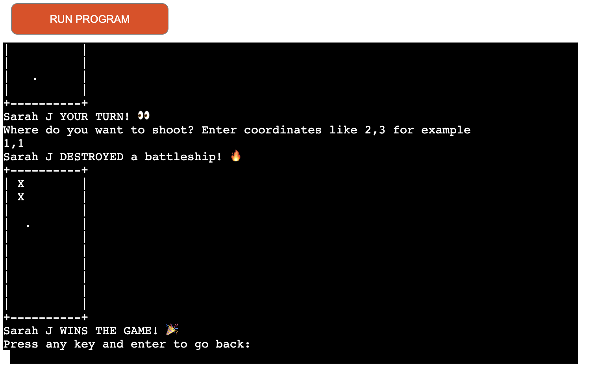

# Battleship
add pic

* 💻 [Deployed Site](https://battleship-cli-game.herokuapp.com/)
* 🗂 [GitHub Repository](https://github.com/sarahjameson/-CI-PP3-Battleship)

## About
Try your hand at playing against a computer! Battleship is a Python command line game where a human can relax and play  against a computer. A definite embarrassment save from losing against a mate!

## Table of Contents
1. [Project Goals](#project-goals)
    1. [User Goals](#user-goals)
    2. [Site Owner Goals](#site-owner-goals)
2. [User Experience](#user-experience)
    1. [Target Audience](#target-audience)
    2. [User Stories](#user-stories)
    3. [User Manual](#user-manual)
3. [Technical Design](#technical-design)
    1. [Flowchart](#flowchart)
    2. [Data Models](#data-models)   
4. [Technologies Used](#technologies-used)
    1. [Languages](#languages)
    2. [Frameworks and Tools](#frameworks-and-tools)
5. [Features](#features)
6. [Testing](#validation)
    1. [Python Validation](#Python-validation)
    2. [Testing user stories](#testing-user-stories)
8. [Bugs](#Bugs)
10. [Deployment](#deployment)
11. [Credits](#credits)
12. [Acknowledgements](#acknowledgements)

## Project Goals
- The Battleship CLI game allows users to play against a computer
- The winner is saved to a Google Sheets file
- The five most recent winners can be viewed

### User Goals
- Be able to enter name to play and if wins, save to Google Sheet
- Be able to read rules of game
- Be able to view 5 most recent winners

### Site Owner Goals
- Create a game where users can relax and take a solitory moment
- Create a game that is easy and clear to user
- Create a game that gives feedback to user during gameplay

## User Experience

### Target Audience
- People of all ages who enjoy games

### User Stories

#### First-time User
1. As a user, I want clear options from the main menu
2. As a user, I want to see an option to read the rules for the game
3. As a user, I want to be able to enter my name and see the personalised game messages throughout the game
4. As a user, I want my name to be recorded if I win the game so that others would be able to see that I have won
5. As a user, I want move feedback throughout the game so I know what is going on at all times

#### Site Owner
6. As a site owner, I want the user to be able to select from the different options in the main menu
7. As a site owner, I want the name to be saved to the Google Sheets and to be able to view them in the game
8. As a site owner, I want data entry to be validated to show them how to correctly format the input

### User Manual

Click here for instructions to use

#### Overview

The Battleship CLI Game is a command line version of the famous Battleship game. The user plays against the computer.

#### Main Menu

On the main menu, the user is presented with an ASCII art rendering of the name 'Battleship'. Beneath that, there is a greeting and there are different options as part of the main menu.
Operation: Input numeric values and press enter key.

1. Play game - enter game play
2. Read rules - prints out rules of game
3. View winners - prints out five most recent winners saved in Google Sheet document
4. Quit - quits program

#### Play Game

With the Play Game option, the user is first instructed to enter their name.
Operation: Enter anything and it will be saved as string.

A personalised message will then appear for them to take their turn. As part of their turn, they must enter suitable coordinates.
Operation: Enter x,y coordinates like 2,3 for example.
Hits and misses are displayed on board. Hits are shown as 'x' whereas misses are shown as '.'.
Computer goes then.

When a players win, the message is shown on the screen and the name is saved to the Google Sheet.
There is then a message to go back to the main menu
Operation: Click any key and enter.

#### Read Rules

With the Read Rule option, the user is presented with the rules for Battleship. They are then given an option to go back to the main menu.
Operation: Click any key and enter.

#### View Winners

With the View Winners option, the user is presented with the five most recent winners. They are then given an option to go back to the main menu.
Operation: Click any key and enter.

#### Quit

With the Quit option, the user exits the program with a goodbye message.

## Technical Design

### Flow Chart

Please view the below flowchat, created with [Lucid](https://lucid.app/)

Flowchart

### Data Models

This project makes use of Object Oriented Programming and user the following as part of this:
1. Classes - classes were used for the game board, shot, battleship and player. The game board and battleship were the most indepth.
2. Lists and dictionaries - lists and dictionaries were used to create the game boards and also to use and manipulate the data sent over by the Google Sheets API.
3. Google Sheets API - Google Sheets API was used as a database to save all the people's names who have won the game before.

## Technologies Used

### Languages Used

- [Python 3](https://www.python.org/)

### Frameworks and Tools

- [Git](https://git-scm.com/) - Used for version control.
- [Heroku](https://www.heroku.com/) - Used for hosting the website on Heroku.
- [Lucid](https://lucid.app/) - Used to draw flowcharts.
- [Google Sheets](https://www.google.com/sheets/about/) - Used to store data outside of running the game.
- [Google Cloud Platform](https://cloud.google.com/cloud-console) - Used to manage permissions to Google Services such as Google Sheets.

### Libraries

- [gspread](https://docs.gspread.org/) - Used to make it easier to work with Google Sheets API.
- [copy][https://docs.python.org/3/library/copy.html] - Used to create two different objects in memory. This was used to create two different game board.
- [random](https://docs.python.org/3/library/random.html) - Used to generate computer's coordinates.
- [os](https://docs.python.org/3/library/os.html) - Used to clear terminal.

## Features

### Main Menu

On the main menu, the user is presented with an ASCII art rendering of the name 'Battleship'. Beneath that, there is a greeting and there are different options as part of the main menu.

Main Menu

This screen covers the following user stories:
1. As a user, I want clear options from the main menu
2. As a user, I want to see an option to read the rules for the game
6. As a site owner, I want the user to be able to select from the different options in the main menu

### Play Game

When playing the game, the user is first instructed to enter their name. A personalised message will then appear for them to take their turn. As part of their turn, they must enter suitable coordinates. The computer will then take its turn. When a players win, the message is shown on the screen and the name is saved to the Google Sheet. There is then a message to go back to the main menu

Play Game

This screen covers the following user stories:
3. As a user, I want to be able to enter my name and see the personalised game messages throughout the game
5. As a user, I want move feedback throughout the game so I know what is going on at all times
8. As a site owner, I want data entry to be validated to show them how to correctly format the input

### Read Rules

When the user selects on the read rules option, the user is presented with the rules for Battleship. They are then given an option to go back to the main menu.

Read Rules

This screen covers the following user stories:
2. As a user, I want to see an option to read the rules for the game

### View Winners

When the user clicks on view winners, they will see the five most recent winners.

View Winners

This screen covers the following user stories:
4. As a user, I want my name to be recorded if I win the game so that others would be able to see that I have won
7. As a site owner, I want the name to be saved to the Google Sheets and to be able to view them in the game

## Validation

### Python Validation

The Python code was validated using [PEP8 Validation Service](http://pep8online.com/). The code passed with 0 errors and 0 warnings.

run.py

### Testing User Stories

1. As a user, I want clear options from the main menu

| **Feature** | **Action** | **Expected Result** | **Actual Result** |
|-------------|------------|---------------------|-------------------|
| Main Menu       |      Select any of the options       | User is presented with different options | Works as expected |

2. As a user, I want to see an option to read the rules for the game

| **Feature** | **Action** | **Expected Result** | **Actual Result** |
|-------------|------------|---------------------|-------------------|
| Read Rules       |      Select from Main Menu      | User is presented with the rules | Works as expected |

3. As a user, I want to be able to enter my name and see the personalised game messages throughout the game

| **Feature** | **Action** | **Expected Result** | **Actual Result** |
|-------------|------------|---------------------|-------------------|
| Game Play       |      Select from Main Menu       | After name entered, they will received personalised messages | Works as expected |

4. As a user, I want my name to be recorded if I win the game so that others would be able to see that I have won

| **Feature** | **Action** | **Expected Result** | **Actual Result** |
|-------------|------------|---------------------|-------------------|
| View Winners       |      Select from Main Menu       | User is presented with different options | Works as expected |

5. As a user, I want move feedback throughout the game so I know what is going on at all times

| **Feature** | **Action** | **Expected Result** | **Actual Result** |
|-------------|------------|---------------------|-------------------|
| Game Play       |      Select from Main Menu       | User is presented with feedback | Works as expected |

6. As a site owner, I want the user to be able to select from the different options in the main menu

| **Feature** | **Action** | **Expected Result** | **Actual Result** |
|-------------|------------|---------------------|-------------------|
| Main Menu       |      Select any of the options       | User is presented with different options | Works as expected |

7. As a site owner, I want the name to be saved to the Google Sheets and to be able to view them in the game

| **Feature** | **Action** | **Expected Result** | **Actual Result** |
|-------------|------------|---------------------|-------------------|
| View Winners       |      Select from Main Menu       | User is presented with five different name who are recorded winners | Works as expected |

8. As a site owner, I want data entry to be validated to show them how to correctly format the input

| **Feature** | **Action** | **Expected Result** | **Actual Result** |
|-------------|------------|---------------------|-------------------|
| Game Play       |      Select from Main Menu       | User is made to enter coordinates correctly | Works as expected |

